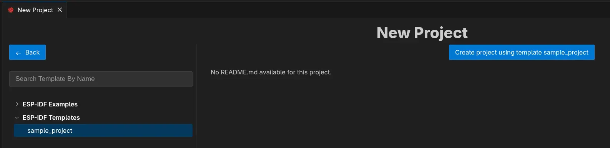
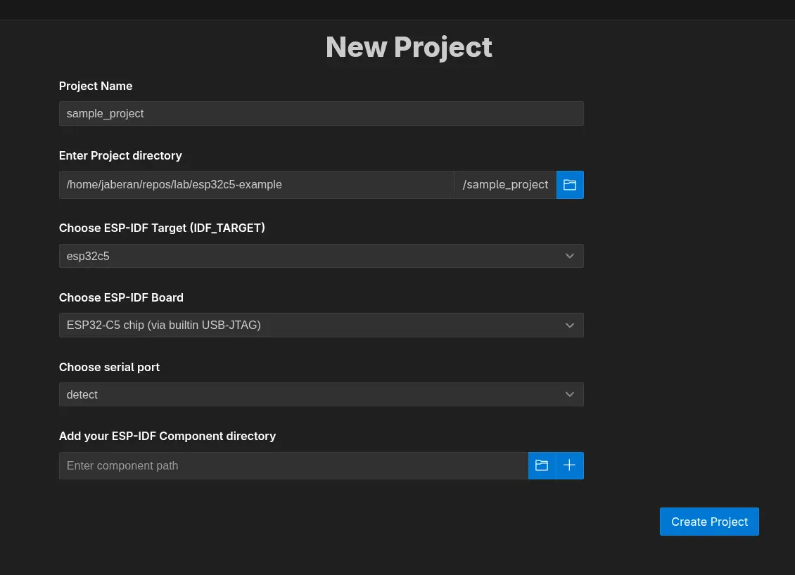
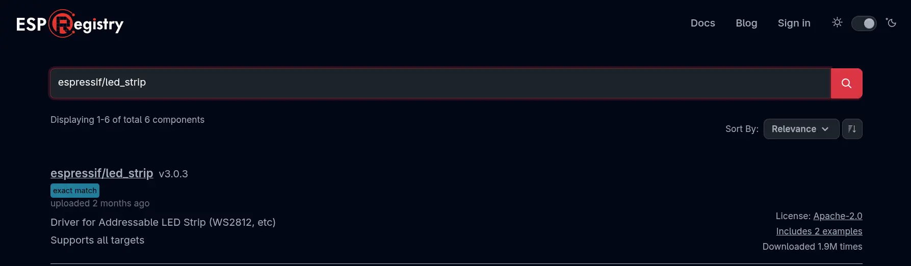

## Úkol 2: Vytváření projektu a Komponenty

---

V tomto úkolu si ukážeme, jak pracovat s koponenty (**Components**) a jak je používat ke zrychlení vývoje vašich projektů.

Komponenty jsou podobné knihovnám (třeba těm z Arduino IDE); také obsahují různou přídavnou funkcionalitu, kterou byste v základním ESP-IDF nenašli. Pro příklad uveďme třeba různé drivery pro senzory, protokolové komponenty nebo různé BSP (*board support package*) komponenty. Některé komponenty jsou již přímou součástí některých ESP-IDF příkladů, je ale možné používat i externí komponenty díky modulární struktuře ESP-IDF.

Díky využívání komponent se nejen zjednododušuje udržovatelnost projektu, také se výrazně zrychluje jeho vývoj. Díky komponentám také lze znovupoužít stejnou funkcionalitu napříč různými projekty.

Pokud chcete vytvořit a publikovat vlastní komponentu (třeba pro váš specifický senzor), doporučujeme, abyste zhlédli talk [DevCon23 - Developing, Publishing, and Maintaining Components for ESP-IDF](https://www.youtube.com/watch?v=D86gQ4knUnc) (v angličtině).

[Sledovat na YouTube](https://www.youtube.com/watch?v=D86gQ4knUnc)

Komponenty můžete prohledávat například přes platformu [ESP Registry](https://components.espressif.com).

Využívání komponentů si ukážeme na novém projektu, kde si od základů napíšeme jednoduchou aplikaci, která rozbliká vestavěnou RGB LED s využitím komponenty pro LED pásky.

### Pracujeme s komponenty

Budeme používat následující dvě komponenty:

* Komponentu pro RGB LED (WS2812) pásky, i když v našem případě bude LED "páskem" pouze jediná vestavěná LED připojená ke `GPIO27`.
* Komponentu [Remote Control Transceiver](https://docs.espressif.com/projects/esp-idf/en/release-v5.2/esp32c5/api-reference/peripherals/rmt.html) (RMT), kterou budeme kontrolovat tok dat do LED.

1. **Vytvoření nového projektu**

Nový projekt lze vytvořit přes GUI i přes příkazovou řádku. Pro ty, kdo s terminálem (CLI) příliš nepracují, to může být poněkud děsivé, v budoucnu vám to ale pomůže například v situacích, kdy budete ESP-IDF používat s jiným IDE než VSCode (nebo úplně samostatně). Níže ale budou uvedené oba příklady.

**GUI**

Otevřeme ESP-IDF Explorer (ikonka Espressifu v taskbaru nebo přes *View -> Open View -> ESP-IDF: Explorer*) a vybereme příkaz **New Project Wizard** (může být schovaný v **Advanced** menu). Dále postupujeme podle obrázků:



*Vybereme, na jaké šabloně náš projekt založíme. Zvolíme *ESP-IDF Templates/sample-project* a klikneme na *Create project using template sample_project*.*



*V dalším kroku vybereme, jak se bude projekt jmenovat, kam ho uložíme a jaký čip budeme používat.*

Po vytvoření projektu se objeví informace o tom, že byl projekt úspěšně vytvořen. Uprostřed by se mělo nacházet tlačítko pro otevření nově vytvořeného projektu - klikneme na něj.

**CLI**

V ESP-IDF Exploreru v záložce *commands* vybereme ESP-IDF Terminal, který se otevře v dolní části obrazovky. Pro vytvoření nového projektu:

* Vytvoříme a přejdeme do složky, ve které chceme mít náš projekt
* Projekt vytvoříme
* Přejdeme do něj

```bash
mkdir ~/my-workshop-folder
cd ~/my-workshop-folder
idf.py create-project my-workshop-project
cd my-workshop-project
```

> Pokud vám příkazy `idf.py ...` nefungují, ujistěte se, že používáte ESP-IDF Terminal a ne jen běžnou konzoli.

Nyní musíme nastavit tzv. **target**. Toto slovo může mít v kontextu ESP-IDF více významů, v našem případě to ale vždy bude znamenat **typ SoC, který používáme**. V našem případě je to ESP32-C5 chip (via Builtin USB JTAG).

V CLI je mírný problém, jelikož může vzniknout nesoulad mezi VSCode a ESP-IDF, proto je lepší místo příkazu nastavovat proměnnou prostředí (*environment variable*).

```bash
export IDF_TARGET=esp32c5
# idf.py set-target esp32c5
```

Nyní jsme připraveni přidat komponentu [espressif/led_strip](https://components.espressif.com/components/espressif/led_strip/versions/3.0.3). Jak již bylo řečeno, komponenta se postará o všechny potřebné ovladače pro náš LED "pásek" o jedné vestavěné diodě.


2. **Přidání komponenty**

**GUI**

* Otevřete *View -> Command Pallete* (Ctrl + Shift + P nebo ⇧ + ⌘ + P) a do nově otevřené řádky napište *ESP-IDF: Show ESP Component Registry*. Nyní vyhledejte **espressif/led_strip** (vyhledávání může zabrat pár vteřin, kdy se zdánlivě nic neděje), klikněte na komponentu, vyberte správnou verzi (**3.0.3**) a klikněte na *Install*.



*Vyhledání komponenty*


*Vyhledání komponenty*

**CLI**

```bash
idf.py add-dependency "espressif/led_strip^3.0.3"
```

Můžete si všimnout, že v hlavním adresáři projektu (**main**) se vytvořil nový soubor s názvem **idf_component.yml**. Při prvním buildu se navíc vytvoří složka  **managed_components** a komponenta se do ní stáhne, pokud byla přidaná přes CLI. Pokud jste komponentu přidali přes GUI, vše se vytvoří i bez buildu.

```yaml
# Obsah idf_component.yml
dependencies:
  espressif/led_strip: "^3.0.3"
    idf: '>=5.0'
```

Závislé komponenty můžete do tohoto souboru přidávat také ručně, bez použití jakýchkoli příkazů.

Nyní se již vrhneme na samotné programování.

3. **Vytvoření funkce, která nakonfiguruje LED a ovladač RMT**

Otevřeme si soubor ``main.c``. Nejdříve musíme importovat potřebné knihovny...

```c
#include "led_strip.h"
#include "esp_log.h"
#include "esp_err.h"
```

...deklarovat potřebné konstanty a logovací tag...

```c
// 10MHz resolution, 1 tick = 0.1us (led strip needs a high resolution)
#define LED_STRIP_RMT_RES_HZ  (10 * 1000 * 1000)

static const char *TAG = "led_strip";
```

...a vytvořit kostru funkce pro konfiguraci. Funkce vrací handle LED "pásku", který budeme používat v `app_main`:

```c
led_strip_handle_t configure_led(void)
{
    led_strip_handle_t led_strip;
    // Your code goes here
    return led_strip;
}
```

Následující kroky budete vpisovat do této funkce na místo komentáře `Your code goes here`.

4. **Konfigurace LED "pásku"**

Použijeme strukturu `led_strip_config_t`. Pro **ESP32-C5-DevKit-C**, LED je typu WS2812.

```c
    led_strip_config_t strip_config = {
        // Set the GPIO that the LED is connected
        .strip_gpio_num = 27,
        // Set the number of connected LEDs, 1
        .max_leds = 1,
        // Set the pixel format of your LED strip
        .color_component_format = LED_STRIP_COLOR_COMPONENT_FMT_GRB,
        // LED model
        .led_model = LED_MODEL_WS2812,
        // In some cases, the logic is inverted
        .flags.invert_out = false,
    };
```

5. **Konfigurace RMT**

Použijeme strukturu `led_strip_rmt_config_t`:

```c
    led_strip_rmt_config_t rmt_config = {
        // Set the clock source
        .clk_src = RMT_CLK_SRC_DEFAULT,
        // Set the RMT counter clock
        .resolution_hz = LED_STRIP_RMT_RES_HZ,
        // Set the memory block size (0 means let driver choose automatically)
        .mem_block_symbols = 0,
        // Set the DMA feature (not supported on the ESP32-C5)
        .flags.with_dma = false,
    };
```

6. **Vytvoření RMT device**

Voláme `led_strip_new_rmt_device()` a zabalíme ji do `ESP_ERROR_CHECK()` — pokud inicializace selže, program se okamžitě zastaví s chybovou hláškou. Po úspěšné inicializaci zalogujeme zprávu pomocí `ESP_LOGI()` a vrátíme handle:

```c
    ESP_ERROR_CHECK(led_strip_new_rmt_device(&strip_config, &rmt_config, &led_strip));
    ESP_LOGI(TAG, "LED strip initialized successfully");
    return led_strip;
```

7. **Vytvoření objektu pro LED "pásek"**

Když máme funkci `configure_led()` hotovu, zavoláme ji v hlavní funkci `app_main` a uložíme vrácený handle do lokální proměnné:

```c
    led_strip_handle_t led_strip = configure_led();
```

8. **Nastavení barev**

K nastavení barvy použijeme funkci `led_strip_set_pixel` s následujícími parametry:
- `led_strip`: námi nakonfigurovaný objekt LED "pásku"
- `0`: index diody v pásku (jelikož máme pouze jednu, index bude vždy 0)
- `20`: červená (RED) složka s hodnotami mezi 0 a 255
- `0`: zelená (GREEN) složka s hodnotami mezi 0 a 255
- `0`: modrá (BLUE) složka s hodnotami mezi 0 a 255

```c
    ESP_ERROR_CHECK(led_strip_set_pixel(led_strip, 0, 20, 0, 0));
```

> Vyzkoušejte si různé hodnoty pro R,G,B kanály!

9. **Update hodnot LED "pásku"**

Samotné nastavení hodnoty pixelu nestačí; aby se hodnoty nastavené v předchozích kroku projevily, je třeba celý "pásek" nejdříve obnovit:

```c
    ESP_ERROR_CHECK(led_strip_refresh(led_strip));
    ESP_LOGI(TAG, "LED strip set to red and refreshed");
```

Pokud chceme celý LED pásek vypnout, můžeme k tomu použít funkci `led_strip_clear(led_strip);`.

10. **Přeložení a odeslání kódu do desky**

Když je náš kód kompletní, musíme ho nějakým způsobem dostat do naší desky. Celý proces se dá rozdělit do 4 kroků:

* Určení **targetu**: konkrétní desky, kterou používáme. V záložce *ESP-IDF explorer* v části *Commands* vybereme možnost **Set Espressif Device Target (IDF_TARGET)**, zvolíme možnost **esp32c5** a v následné nabídce vybereme možnost **ESP32-C5 chip (via builtin USB-JTAG)**.
* **Build**: sestavení aplikace a vytvoření binárního souboru, který budeme nahrávat. Na stejném místě jako posledně klikneme na příkaz **Build Project**.
* Výběr správného **seriového portu**, ke kterému je naše deska připojená. I seriový port nastavíme pomocí příkazu v *ESP-IDF Exploreru*, tentokrát pomocí **Select Port to Use**.
* **Flash**: nahrání binárního souboru na desku. K tomu nám poslouží stejnojmenný příkaz, který lze nalézt hned vedle ostatních. Pokud se nás VScode zeptá na "flash method", vybereme "UART". 

Pokud někdo omylem vybere špatnou flashovací metodu (např JTAG), stačí v souboru `.vscode/settings.json` manuálně upravit `"idf.flashType":` na  `"UART"`.

> Všechny příkazy lze vyvolat také pomocí *Command Pallete*, kterou otevřete kombinací kláves Ctrl + Shift + P nebo ⇧ + ⌘ + P. Příkazy se ovšem jmenují občas trochu jinak (například místo *Select Serial Port* se příkaz jmenuje *ESP-IDF: Select Port to Use* ). Oba přístupy ale můžete libovolně kombinovat.  

#### Kompletní kód

Níže naleznete kompletní a okomentovaný kód pro tento úkol:
```c
#include <stdio.h>
#include "led_strip.h"
#include "esp_log.h"
#include "esp_err.h"

// 10MHz resolution, 1 tick = 0.1us (led strip needs a high resolution)
#define LED_STRIP_RMT_RES_HZ  (10 * 1000 * 1000)

static const char *TAG = "led_strip";

led_strip_handle_t configure_led(void)
{
    // LED strip general initialization, according to your led board design
    led_strip_config_t strip_config = {
        // Set the GPIO that the LED is connected
        .strip_gpio_num = 27,
        // Set the number of connected LEDs in the strip
        .max_leds = 1,
        // Set the pixel format of your LED strip
        .color_component_format = LED_STRIP_COLOR_COMPONENT_FMT_GRB,
        // LED strip model
        .led_model = LED_MODEL_WS2812,
        // In some cases, the logic is inverted
        .flags.invert_out = false,
    };

    // LED strip backend configuration: RMT
    led_strip_rmt_config_t rmt_config = {
        // Set the clock source
        .clk_src = RMT_CLK_SRC_DEFAULT,
        // Set the RMT counter clock
        .resolution_hz = LED_STRIP_RMT_RES_HZ,
        // Set the memory block size (0 means let driver choose automatically)
        .mem_block_symbols = 0,
        // Set the DMA feature (not supported on the ESP32-C5)
        .flags.with_dma = false,
    };

    // LED Strip object handle
    led_strip_handle_t led_strip;
    ESP_ERROR_CHECK(led_strip_new_rmt_device(&strip_config, &rmt_config, &led_strip));
    ESP_LOGI(TAG, "LED strip initialized successfully");
    return led_strip;
}

void app_main(void)
{
    led_strip_handle_t led_strip = configure_led();
    ESP_ERROR_CHECK(led_strip_set_pixel(led_strip, 0, 20, 0, 0));
    ESP_ERROR_CHECK(led_strip_refresh(led_strip));
    ESP_LOGI(TAG, "LED strip set to red and refreshed");
}
```

#### Předpokládaný výsledek

Vestavěná LED by se měla rozsvítit červeně.

> **Poznámka:** **Poznámka k BSP:** Generická BSP komponenta [espressif/esp_bsp_generic](https://components.espressif.com/components/espressif/esp_bsp_generic/) (verze **1.2.0**) v současné době ESP32-C5 nepodporuje, proto není přístup přes BSP v tomto workshopu obsažen. Pokud vás BSP zajímá, podívejte se na verzi workshopu pro ESP32-C6.

## Další krok

Budiž světlo! Když zvládáme základní práci s ESP a IDE, jsme připravení se připojit i k WiFi!

[Úkol 3: Připojení k Wi-Fi](../assignment-3)
