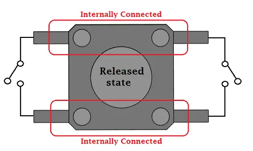
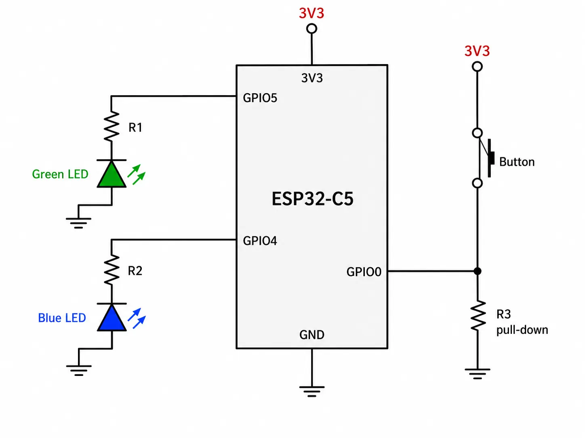
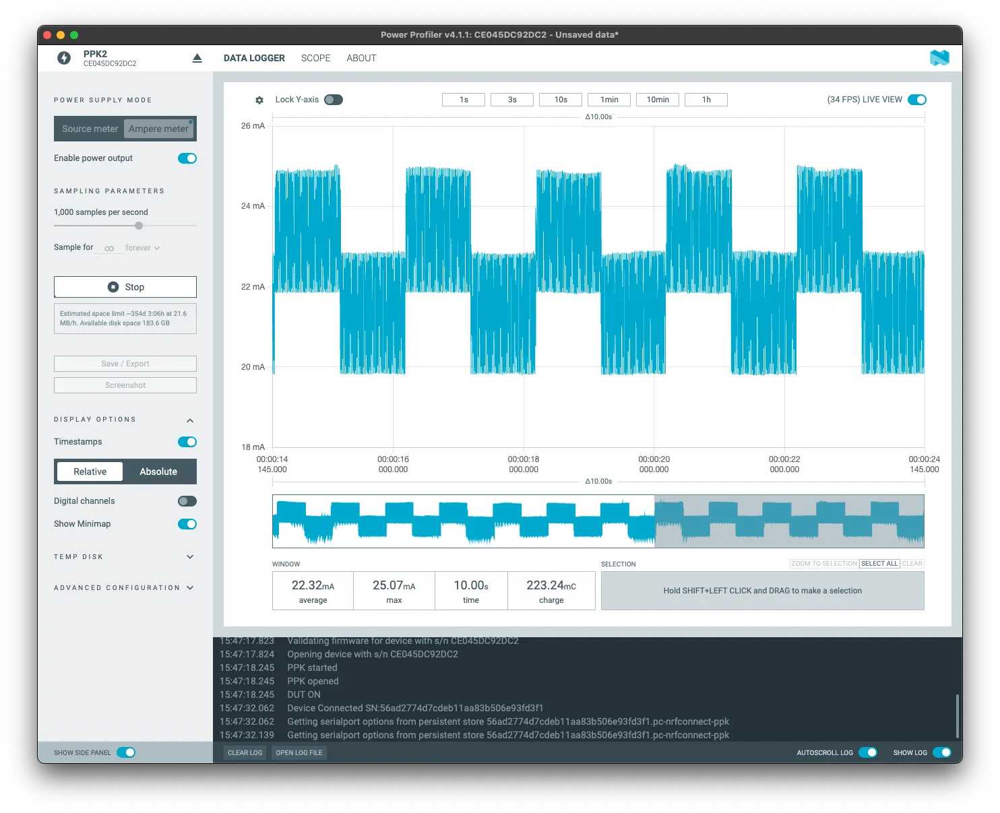
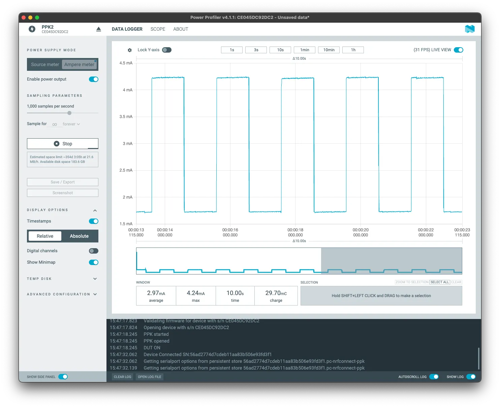

## Úkol 6: Low Power Core

---
ESP32-C5 má dvě jádra: high-power (HP) jádro pro standardní použití a low-power (LP) jádro pro
minimalizaci spotřeby.

Druhému jádru se hlavně v angličtině často říká **Ultra-Low-Power (ULP) core** a je určené
především na to, aby zvládalo jednoduché úlohy, zatímco je hlavní (HP) jádro v režimu spánku,
čímž výrazně klesá spotřeba elektrické energie. Tuto funkci jistě ocení ti, kteří staví projekty
napájené z baterií, kde se nehraje tolik na výkon, jako spíše na efektivitu.

ULP jádro může fungovat nezávisle na HP jádře, kdy může například sbírat data ze senzorů a
provádět jejich základní zpracování, nebo ovládání GPIO, to vše při naprosto minimální spotřebě a
taktu 20 MHz, což je srovnatelné například s Arduinem UNO. Pokud vás zajímá kompletní přehled
toho, co toto jádro dokáže, navštivte dokumentaci o
[ULP LP-Core Coprocessor Programming](https://docs.espressif.com/projects/esp-idf/en/latest/esp32c5/api-reference/system/ulp-lp-core.html#).

### (U)LP jádro

- 32-bit RISC-V core @40MHz (podle použitého krystalu až 48 MHz)
- 16KB LP SRAM
- RISC-V IMAC (**I**nteger, **M**ultiplication/Division, **A**tomic, **C**ompressed) instrukční
  set
- Funguje jako koprocesor
- Má přístup k vybraným periferiím
  - LP IO (LPGPIO0-LPGPIO6)
  - UART
  - I2C

Můžete se podívat na DevCon23 talk "Low-Power Features of ESP32-C6: Target Wake Time + LP Core",
který pokrývá některé aspekty LP jádra a TWT:

[Sledovat na YouTube](https://www.youtube.com/watch?v=FpTwQlGtV0k)

#### ULP pinout

ULP jádro používá specifický set pinů. Pokud budete potřebovat vědět detaily, použijte
[rozložení pinů](../introduction/#board-pin-layout), abyste věděli, které piny budou s LP jádrem
spolupracovat.

### Praktická práce s LP jádrem

V této ukázce si napíšeme kód, který rozbliká LED. Jednou se o řízení bude starat "velké" HP
jádro, podruhé tutéž práci zastane ULP jádro. Zkusíme přitom porovnat spotřebu.

> **Poznámka:** **Pro tento úkol vytvoříme nový prázdný projekt.** Pro podrobnější instrukce
> navštivte 1. kapitolu (vytváření projektu z příkladu `sample_project`).
>
> Také bude důležité, abyste vždy upravovali správný soubor - v projektu bude několik
> stejnojmenných souborů ``main.c`` a ``CMakeLists.txt``.

1. **Vytvořte složku `main/ulp` a uvnitř soubor `main.c`**

```c
#include <stdint.h>
#include <stdbool.h>
#include "ulp_lp_core.h"
#include "ulp_lp_core_utils.h"
#include "ulp_lp_core_gpio.h"
#include "ulp_lp_core_interrupts.h"

#define WAKEUP_PIN LP_IO_NUM_0
#define BLUE_PIN    LP_IO_NUM_4
#define GREEN_PIN  LP_IO_NUM_5

static uint32_t wakeup_count;
uint32_t start_toggle;

void LP_CORE_ISR_ATTR ulp_lp_core_lp_io_intr_handler(void)
{
    ulp_lp_core_gpio_clear_intr_status();
    wakeup_count++;
}

int main (void)
{
    /* Register interrupt for the wakeup pin */
    ulp_lp_core_intr_enable();
    ulp_lp_core_gpio_intr_enable(WAKEUP_PIN, LP_IO_INTR_POSEDGE);

    int level = 0;
    while (1) {
        /* Toggle the Red LED GPIO */
        ulp_lp_core_gpio_set_level(GREEN_PIN, 0);
        ulp_lp_core_gpio_set_level(BLUE_PIN, level);
        level = level ? 0 : 1;
        ulp_lp_core_delay_us(1000000);

        /* Wakeup the main processor after 4 toggles of the button */
        if (wakeup_count >= 4) {
            ulp_lp_core_gpio_set_level(BLUE_PIN, 0);
            ulp_lp_core_wakeup_main_processor();
            wakeup_count = 0;
        }
    }
    /* ulp_lp_core_halt() is called automatically when main exits */
    return 0;
}
```

V tomto kódu povolujeme přerušení (*interrupt*) na LP jádře pomocí `ulp_lp_core_intr_enable`,
přičemž nastavujeme `GPIO0` jako vstupní pin, aktivovaný vzestupnou hranou (přechod signálu ze
stavu LOW do stavu HIGH). K připojení pinu a přerušení používáme funkci
`ulp_lp_core_gpio_intr_enable`. *Wake up counter* bude obstaráván *interrupt handlerem*
`ulp_lp_core_lp_io_intr_handler`.

Nyní se spustí smyčka pro blikání a *wake up counter*. Hodnota našeho GPIO je nastavená funkcí
`ulp_lp_core_gpio_set_level`. Pokud je počet zmáčknutí tlačítka 4 nebo výše, spustí se HP jádro
funkcí `ulp_lp_core_wakeup_main_processor`.

2. **Změny v `main/CMakeLists.txt`**

V CMake musíme nastavit jméno ULP aplikace, zdrojové soubory a další...

```text
# Set usual component variables
set(app_sources "main.c")
idf_component_register(SRCS ${app_sources}
                       REQUIRES ulp
                       WHOLE_ARCHIVE)
#
# ULP support additions to component CMakeLists.txt.
#
# 1. The ULP app name must be unique (if multiple components use ULP).
set(ulp_app_name ulp_${COMPONENT_NAME})
#
# 2. Specify all C and Assembly source files.
#    Files should be placed into a separate directory (in this case, ulp/),
#    which should not be added to COMPONENT_SRCS.
set(ulp_sources "ulp/main.c")
#
# 3. List all the component source files which include automatically
#    generated ULP export file, ${ulp_app_name}.h:
set(ulp_exp_dep_srcs ${app_sources})
#
# 4. Call function to build ULP binary and embed in project using the argument
#    values above.
ulp_embed_binary(${ulp_app_name} "${ulp_sources}" "${ulp_exp_dep_srcs}")

```

3. **Kód v `main/main.c` pro HP jádro**

```c
#include <stdio.h>
#include "esp_sleep.h"
#include "driver/gpio.h"
#include "driver/rtc_io.h"
#include "ulp_lp_core.h"
#include "ulp_main.h"
#include "freertos/FreeRTOS.h"
#include "freertos/task.h"

extern const uint8_t ulp_main_bin_start[] asm("_binary_ulp_main_bin_start");
extern const uint8_t ulp_main_bin_end[]   asm("_binary_ulp_main_bin_end");

static void init_ulp_program(void);

#define WAKEUP_PIN  GPIO_NUM_0
#define BLUE_PIN    GPIO_NUM_4
#define GREEN_PIN   GPIO_NUM_5

void app_main(void)
{
    vTaskDelay(pdMS_TO_TICKS(1000));

    esp_sleep_wakeup_cause_t cause = esp_sleep_get_wakeup_cause();
    if (cause == ESP_SLEEP_WAKEUP_ULP) {
        printf("ULP woke up the main CPU! \n");
        ulp_lp_core_stop();
    }

    printf("In active mode\n");
    printf("Long press the wake button to put the chip to sleep and run the ULP\n");

    rtc_gpio_init(WAKEUP_PIN);
    rtc_gpio_set_direction(WAKEUP_PIN, RTC_GPIO_MODE_INPUT_ONLY);
    rtc_gpio_pulldown_dis(WAKEUP_PIN);
    rtc_gpio_pullup_dis(WAKEUP_PIN);

    rtc_gpio_init(BLUE_PIN);
    rtc_gpio_set_direction(BLUE_PIN, RTC_GPIO_MODE_OUTPUT_ONLY);
    rtc_gpio_pulldown_dis(BLUE_PIN);
    rtc_gpio_pullup_dis(BLUE_PIN);

    rtc_gpio_init(GREEN_PIN);
    rtc_gpio_set_direction(GREEN_PIN, RTC_GPIO_MODE_OUTPUT_ONLY);
    rtc_gpio_pulldown_dis(GREEN_PIN);
    rtc_gpio_pullup_dis(GREEN_PIN);

    int gpio_level = 0;
    int previous_gpio_level = 0;
    int cnt = 0;

    while (1) {
        rtc_gpio_set_level(BLUE_PIN, 0);
        rtc_gpio_set_level(GREEN_PIN, 1);
        vTaskDelay(pdMS_TO_TICKS(1000));
        rtc_gpio_set_level(GREEN_PIN, 0);
        vTaskDelay(pdMS_TO_TICKS(1000));

        gpio_level = rtc_gpio_get_level(WAKEUP_PIN);
        if (gpio_level != previous_gpio_level) {
            previous_gpio_level = gpio_level;
            cnt++;
            if (cnt > 1) {
                rtc_gpio_set_level(GREEN_PIN, 0);
                cnt = 0;
                break;
            }
        }
    }

    init_ulp_program();

    printf("Entering Deep-sleep mode\n\n");
    printf("Press the wake button at least 3 or 4 times to wake up the main CPU again\n");
    vTaskDelay(10);

    ESP_ERROR_CHECK( esp_sleep_enable_ulp_wakeup());

    esp_deep_sleep_start();
}

static void init_ulp_program(void)
{
    esp_err_t err = ulp_lp_core_load_binary(ulp_main_bin_start,
                        (ulp_main_bin_end - ulp_main_bin_start));
    ESP_ERROR_CHECK(err);

    ulp_lp_core_cfg_t cfg = {
        .wakeup_source = ULP_LP_CORE_WAKEUP_SOURCE_HP_CPU,
    };

    err = ulp_lp_core_run(&cfg);
    ESP_ERROR_CHECK(err);
}
```

4. **Zapnutí LP jádra v konfiguraci**

Abychom LP jádro zapnuli a mohli pro něj překládat, musíme nastavit následující konfigurační
parametry v konfiguraci projektu. Například tak, že vytvoříme `sdkconfig.defaults` s následujícím
obsahem:

```text
# Enable ULP
CONFIG_ULP_COPROC_ENABLED=y
CONFIG_ULP_COPROC_TYPE_LP_CORE=y
CONFIG_ULP_COPROC_RESERVE_MEM=4096
# Set log level to Warning to produce clean output
CONFIG_BOOTLOADER_LOG_LEVEL_WARN=y
CONFIG_BOOTLOADER_LOG_LEVEL=2
CONFIG_LOG_DEFAULT_LEVEL_WARN=y
CONFIG_LOG_DEFAULT_LEVEL=2
```

5. **Nastavení HW**

Na tenhle příklad budete navíc potřebovat 2 LED a jedno tlačítko připojené na následující piny:

- Modrá LED -> **GPIO4**
- Zelená LED -> **GPIO5**
- Čudlík (pull-down, active high) -> **GPIO0**. Jinak řečeno, jednu "stranu" tlačítka připojíme
  na **3.3V** a druhou na **GPIO0**. Navíc ještě mezi **GPIO0** a **GND** připojíme rezistor.



*Schéma tlačítka*



*Kompletní schéma ukazující, jak připojit obě LED (GPIO4, GPIO5) a tlačítko (GPIO0) k
ESP32-C5-DevKitC-1.*

6. **Build, flash, a monitor výstupu z desky**

Zkontrolujte si, že pro nahrávání a následné monitorování výstupu používáte USB port s nápisem
**UART**. Nic nezkazíte ani vymazáním flash paměti (příkaz *Erase Flash*) předtím, než nahrajeme
tenhle příklad.

#### Co by se mělo stát...

Po naflashování by měla začít každou vteřinu blikat zelená LED s následujícím výstupem:

```text
In active mode
Long press the wake button to put the chip to sleep and run the ULP
```

Pokud dlouze stiskneme tlačítko, mělo by dojít k aktivaci LP jádra a přepnutí HP jádra do
*Deep-sleep mode*. Modrá LED začne blikat s frekvencí jedné vteřiny s následujícím výstupem:

```text
Entering Deep-sleep mode
Press the wake button at least 3 or 4 times to wake up the main CPU again
```

Probuzení z *Deep-sleep mode* provedeme čtyřkliknutím na tlačítko:

```text
ULP woke up the main CPU!
In active mode
Long press the wake button to put the chip to sleep and run the ULP
```

Pro měření spotřeby používáme vyvedený konektor J5 a vhodný nástroj, třeba
[JouleScope](https://www.joulescope.com/) nebo
[PPK2](https://www.nordicsemi.com/Products/Development-hardware/Power-Profiler-Kit-2).

**LED blikání s HP jádrem**

S využitím "velkého" HP jádra je průměrná spotřeba za 10 vteřin zhruba **22.32mA**.



**LED blikání s LP jádrem**

Pokud ale aplikaci přeneseme na LP jádro, rázem spadneme o řád níže: **2.97mA**.



Když přepneme jádra, dosáhneme úspory (až) **86.7%** pro stejný úkol. Příklad je ale pouze
orientační a reálné hodnoty se samozřejmě budou lišit.

Více příkladů s LP jádrem (anglicky):

- [LP Core simple example with GPIO Polling](https://github.com/espressif/esp-idf/tree/master/examples/system/ulp/lp_core/gpio)
- [LP Core Pulse Counting Example](https://github.com/espressif/esp-idf/tree/master/examples/system/ulp/lp_core/gpio_intr_pulse_counter)
- [LP-Core example with interrupt triggered from HP-Core](https://github.com/espressif/esp-idf/tree/master/examples/system/ulp/lp_core/interrupt)
- [LP I2C Example](https://github.com/espressif/esp-idf/tree/master/examples/system/ulp/lp_core/lp_i2c)
- [LP UART Examples](https://github.com/espressif/esp-idf/tree/master/examples/system/ulp/lp_core/lp_uart)

## Závěr

Moc děkujeme za účast v našem workshopu a doufáme, že vám přinesl něco užitečného!

Během workshopu jsme si prošli několika různými tématy:

- **Úkol 1**: Úspěšně jsme nainstalovali ESP-IDF a naučili jsme se základy jeho použití.
- **Úkol 2**: Naučili jsme se, jak vytvořit nový projekt, co to jsou komponenty a jak s nimi
  pracovat.
- **Úkol 3**: Připojili jsme se k Wi-Fi, což je asi nejdůležitější krok v celém IoT světě.
- **Úkol 4**: Vyzkoušeli jsme si NVS (Non-Volatile Storage) a práci s perzistentními daty. Také
  jsme si řekli, co to je *partition table* a jak ji upravit.
- **Úkol 5**: Vyzkoušeli jsme si *Wi-Fi provisioning* a naučili jsme se, jak posunout konfiguraci
  Wi-Fi na našich zařízeních o úroveň výš.
- **Úkol 6**: Vyzkoušeli jsme si LP jádro a naučili jsme se, jak ovládat spotřebu.

I přesto, že jsme prošli několik vcelku různorodých témat, sotva jsme sklouzli po povrchu. Jak
ESP32, tak i ESP-IDF toho nabízejí mnohem více. Všichni ale doufáme, že jsme vám tímhle
workshopem dali pevný základ, na kterém budete schopní sami dále pracovat a rozvíjet vaše
projekty.

Ještě jednou děkujeme za účast a těšíme se na vaše projekty!

---

[← Zpět na domovskou stránku C5 workshopu](../)
