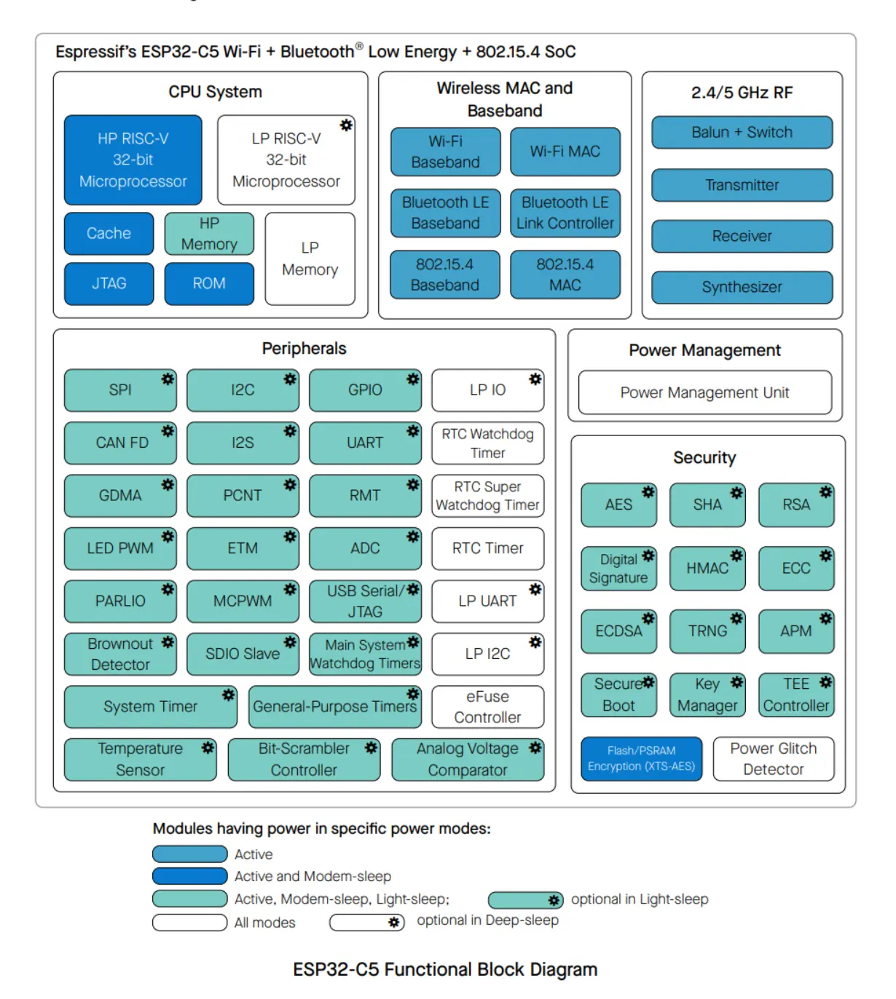
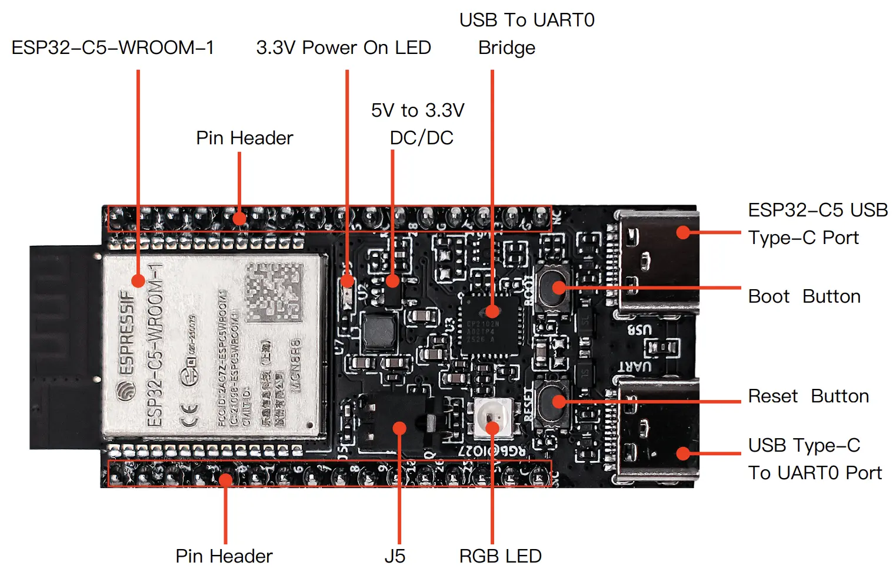

## Představení ESP-IDF

> **Poznámka:** Ve srovnání s workshopem pro ESP32-C6 tento workshop z časových důvodů vynechává kapitolu o protokolech a TLS.
> Pokud si chcete toto téma přesto projít, použijte příklady z ESP-IDF, [esp-protocols](https://github.com/espressif/esp-protocols) nebo workshop pro ESP32-C6.

**ESP-IDF** (Espressif IoT Development Framework) je oficiální vývojový framework pro všechny čipy rodiny ESP32 od firmy Espressif Systems. Framework poskytuje kompletní prostředí pro vývoj, flashování a monitorování IoT aplikací, které mohou pokrývat vše od sítí přes bezpečnost, až po vysoce spolehlivé aplikace. Samotné čipy ESP32 jsou populární napříč odvětvími, od domácích kutilů a bastlířů až po profesionální a průmyslové nasazení. 

ESP-IDF v sobě obsahuje také FreeRTOS, který vývojářům umožňuje tvořit *real-time* aplikace s podporou multitaskingu. Díky široké paletě knihoven, komponent, podporovaných protokolů (Wi-Fi, Bluetooth, Thread, ZigBee, MQTT a mnoho dalšího), nástrojům a podrobné dokumentaci ESP-IDF usnadňuje vývoj IoT aplikací a umožňuje jednoduché využití velkého spektra hardware a periferií. 

Zároveň ESP-IDF obsahuje zhruba 400 příkladových projektů, pokrývajících základní případy použití, což umožňuje vývojářům dále zrychlit počáteční fázi vývoje a ti tak mohou rychleji začít pracovat na svých projektech. 

### Architektura

Architektura frameworku ESP-IDF je rozdělená do 3 vrstev:

- **ESP-IDF platforma**
  - Obsahuje samotné jádro ESP-IDF: FreeRTOS, ovladače, protokoly, build system...
- **Middleware**
  - Přidává další funkcionalitu do ESP-IDF, například audio framework ESP-ADF
- **AIoT aplikace**
  - Váš projekt

### Frameworks

Na ESP-IDF je základených i několik dalších frameworků:

- **Arduino for ESP32**
- **ESP-ADF** (Audio Development Framework): Připravený pro audio aplikace
- **ESP-WHO** (AI Development Framework): Zaměřený na rozpoznávání a detekci obličeje
- **ESP-RainMaker**: Díky cloudovým službám zjednodušuje připojení a ovládání zařízení s ESP32
- **ESP-Matter SDK**: Oficiální vývojový framework pro Matter na čipech rodiny ESP32

Pokud se chcete podívat na všechny odvozené frameworky, navštivte náš [GitHub](https://github.com/espressif).

### Podpora různých verzí ESP-IDF

ESP-IDF se stále vyvíjí. Pro aktuální informace o podporovaných verzích navšitvte náš Github. 

[espressif/esp-idf na GitHubu](https://github.com/espressif/esp-idf)

## Představení ESP32-C5

ESP32-C5 je *ultra-low-power* čip s architekturou RISC-V. Obsahuje jedno "plnohodnotné" a jedno ULP (*ultra-low-power*) jádro a podporuje všechny běžné bezdrátové technologie:  2.4 a 5 GHz Wi-Fi 6 (802.11ax), Bluetooth® 5 (LE), Zigbee a Thread (802.15.4). K dispozici je volitelná 4MB flash paměť přímo v pouzdře čipu, 29 GPIO pinů a bohatá nabídka periferií:

- 29 pinů
- 7 strapping pinů
- 6 GPIO pinů je potřebných pro in-package flash
- **Analogová rozhraní:**
  - 12-bit SAR ADC, až 7 kanálů
  - Senzor teploty
- **Digitální rozhraní:**
  - 2x UARTs
  - 2x SPI pro komunikaci s flash pamětí
  - SPI pro obecné použití
  - I2C
  - Low-power (LP) I2C
  - I2S
  - Pulse count kontroler
  - USB Serial/JTAG kontroler
  - 2x CAN-FD kontrolery
  - SDIO 2.0 slave kontroler
  - LED PWM controller, až 6 kanálů
  - Motor Control PWM (MCPWM)
  - Remote control periferie (TX/RX)
  - Paralelní IO rozhraní (PARLIO)
  - Obecný DMA kontroler se 3 transmit 3 receive kanály
  - Event task matrix (ETM)
- **Timery:**
  - 52-bit systémový timer
  - 2x 54-bit timer pro obecné použití
  - 48-bit RTC timer
  - 3x digitální watchdog
  - Analogový watchdog

Pro více detailů se podívejte na [datasheet ESP32-C5](https://www.espressif.com/sites/default/files/documentation/esp32-c5_datasheet_en.pdf).

## Představení kitu ESP32-C5-DevKit-C

ESP32-C5-DevKitC-1 je vývojová deska určená (nejen) začátečníkům, v jejímž srdci je modul ESP32-C5-WROOM-1 spolu s 8 MB SPI flash paměti. Stejně jako samotný čip ESP32-C5, deska podporuje mnoho protokolů, od Wi-Fi, přes Bluetooth LE, až po Zigbee a Thread.

Většina GPIO pinů je přístupná z vývodů po stranách desky se standardní roztečí 2.54 mm. Periferie na ně můžou být připojené pomocí klasických vodičů, případně lze desku zacvaknout do nepájivého pole. 

### Vlastnosti

Níže jsou uvedené základní vlastnosti vývojého kitu:

- ESP32-C5-WROOM-1 modul
- Pinové vývody po stranách
- 5 V to 3.3 V low-dropou regulátor
- 3.3 V Power On LED
- USB-to-UART Bridge
- ESP32-C5 USB Type-C Port pro flashování a debug
- Boot Button
- Reset Button
- USB Type-C to UART Port
- RGB LED na pinu GPIO8
- J5 jumper pro měření proudu

#### Popis desky

#### Pinout desky

#### J1 pinové pole

| No. | Name | Type | Function |
|---|---|---|---|
| 1 | 3V3 | P | 3.3 V power supply |
| 2 | RST | I | High: enables the chip; Low: disables the chip. |
| 3 | 2 | I/O/T | MTMS, GPIO2, **LP_GPIO2**, **LP_UART_RTSN**, **LP_I2C_SDA**, ADC1_CH1, FSPIHQ |
| 4 | 3 | I/O/T | MTDI, GPIO3, **LP_GPIO3**, **LP_UART_CTSN**, **LP_I2C_SCL**, ADC1_CH2 |
| 5 | 0 | I/O/T | GPIO0, **LP_GPIO0**, **LP_UART_DTRN**, XTAL_32K_P |
| 6 | 1 | I/O/T | GPIO1, **LP_GPIO1**, **LP_UART_DSRN**, XTAL_32K_N, ADC1_CH0 |
| 7 | 6 | I/O/T | GPIO6, **LP_GPIO6**, ADC1_CH5, FSPICLK |
| 8 | 7 | I/O/T | GPIO7, FSPID, SDIO_DATA1 |
| 9 | 8 | I/O/T | GPIO8, PAD_COMP0, SDIO_DATA0 |
| 10 | 9 | I/O/T | GPIO9, PAD_COMP1, SDIO_CLK |
| 11 | 10 | I/O/T | GPIO10, FSPICS0, SDIO_CMD |
| 12 | 26 | I/O/T | GPIO26 |
| 13 | 25 | I/O/T | GPIO25 |
| 14 | 5V | P | 5 V power supply |
| 15 | G | G | Ground |
| 16 | NC | – | No connection |

#### J3 pinové pole

| No. | Name | Type | Function |
|---|---|---|---|
| 1 | G | G | Ground |
| 2 | TX | I/O/T | U0TXD, GPIO11 |
| 3 | RX | I/O/T | U0RXD, GPIO12 |
| 4 | 24 | I/O/T | GPIO24 |
| 5 | 23 | I/O/T | GPIO23 |
| 6 | NC/15 | I/O/T | No connection/GPIO15 |
| 7 | 27 | I/O/T | GPIO27 |
| 8 | 4 | I/O/T | MTCK, GPIO4, **LP_GPIO4**, **LP_UART_RXD**, ADC1_CH3, FSPIHD |
| 9 | 5 | I/O/T | MTDO, GPIO5, **LP_GPIO5**, **LP_UART_TXD**, ADC1_CH4, FSPIWP |
| 10 | NC | – | No connection |
| 11 | 28 | I/O/T | GPIO28 |
| 12 | G | G | Ground |
| 13 | 14 | I/O/T | GPIO14, USB_D+, SDIO_DATA2 |
| 14 | 13 | I/O/T | GPIO13, USB_D-, SDIO_DATA3 |
| 15 | G | G | Ground |
| 16 | NC | – | No connection |

### Zdroje

- [ESP32-C5 Datasheet](https://www.espressif.com/sites/default/files/documentation/esp32-c5_datasheet_en.pdf)
- [ESP32-C5 Documentation](https://docs.espressif.com/projects/esp-idf/en/release-v5.3/esp32c5/index.html)
- [ESP32-C5-DevKit-C Documentation](https://docs.espressif.com/projects/espressif-esp-dev-kits/en/latest/esp32c5/esp32-c5-devkitc-1/user_guide.html)
- [ESP32-C5-DevKit-C Schematic](https://docs.espressif.com/projects/espressif-esp-dev-kits/en/latest/_static/esp32-c5-devkitc-1/schematics/esp32-c5-devkitc-1-schematics_v1.2.pdf)

## Další krok

Pro teoretickém úvodu již nastal čas pustit se do programování. Nejprve si ale musíme naisntalovat potřebné nástroje.

[Úkol 1: Instalace ESP-IDF](../assignment-1)
