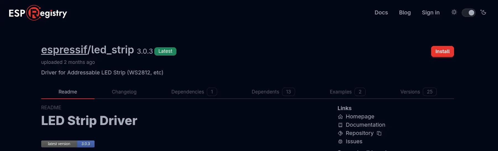

## Assignment 2: Create a new project with Components

---

In this assignment, we will show how to work with **Components** and how to use them to speed up
the development of your projects.

Components are similar to libraries (like those from Arduino IDE); they also contain various
additional functionality that you wouldn't find in basic ESP-IDF. For example, let's mention
various drivers for sensors, protocol components, or BSP (*board support package*) components.
Some components are already a direct part of some ESP-IDF examples, but it is also possible to use
external components thanks to the modular structure of ESP-IDF.

By using components, not only is project maintainability simplified, but its development is also
significantly accelerated. Components also allow the same functionality to be reused across
different projects.

If you want to create and publish your own component (for example for your specific sensor), we
recommend that you watch the talk DevCon23 - Developing, Publishing, and Maintaining Components
for ESP-IDF:

[Watch on YouTube](https://www.youtube.com/watch?v=D86gQ4knUnc)

You can browse components, for example, through the
[ESP Registry](https://components.espressif.com) platform.

We will demonstrate the use of components on a new project, where we will write a simple
application from scratch that will blink the built-in RGB LED using a component for LED strips.

### Working with components

We will use the following two components:

* Component for RGB LED (WS2812) strips, although in our case the LED "strip" will be only a
  single built-in LED connected to `GPIO27`.
* [Remote Control Transceiver](https://docs.espressif.com/projects/esp-idf/en/release-v5.2/esp32c5/api-reference/peripherals/rmt.html)
  (RMT) component, which we will use to control the data flow to the LED.

1. **Creating a new project**

A new project can be created via GUI or command line. For those who don't work much with terminal
(CLI), it can be somewhat scary, but in the future it will help you, for example, in situations
where you will use ESP-IDF with an IDE other than VSCode (or completely standalone). Both examples
are given below.

**GUI**

Open ESP-IDF Explorer (Espressif icon in taskbar or via *View -> Open View -> ESP-IDF: Explorer*)
and select **New Project Wizard** command (may be hidden in **Advanced** menu). Then proceed
according to the pictures:


*Creating a new project. Serial port is not important, it can be changed later.*


*In the next step we choose what template to base our project on. We choose
*get-started/hello_world* and create the project.*

After creating the project, an unobtrusive window will appear in the bottom right, which will ask
you whether you want to open the newly created project in a new window. Click "Yes".

**CLI**

In the ESP-IDF Explorer in the *commands* tab, select ESP-IDF Terminal, which will open at the
bottom of the screen. To create a new project:

* Create and go to the folder where we want to have our project
* Create the project
* Go to it

```bash
mkdir ~/my-workshop-folder 
cd ~/my-workshop-folder 
idf.py create-project my-workshop-project
cd my-workshop-project
```

> If the `idf.py ...` commands don't work for you, make sure you're using ESP-IDF Terminal and
> not just a regular console.

Now we need to set the so-called **target**. This word can have multiple meanings in the context
of ESP-IDF, but in our case it will always mean **the type of SoC we are using**. In our case it
is ESP32-C5 chip (via Builtin USB JTAG).

In CLI there is a slight problem, as there may be a mismatch between VSCode and ESP-IDF, so it is
better to set an environment variable instead of a command.

```bash
export IDF_TARGET=esp32c5
# idf.py set-target esp32c5
```

Now we are ready to add the
[espressif/led_strip](https://components.espressif.com/components/espressif/led_strip/versions/3.0.3)
component. As already mentioned, the component will take care of all the necessary drivers for our
LED "strip" with one built-in diode.

2. **Adding a component**

**GUI**

* Open *View -> Command Palette* (Ctrl + Shift + P or ⇧ + ⌘ + P) and type *ESP-IDF: Show ESP
  Component Registry* in the newly opened line. Now search for **espressif/led_strip** (searching
  may take a few seconds when seemingly nothing happens), click on the component, select the
  correct version (**3.0.3**) and click *Install*.


*Component search*



*Component installation*

**CLI**

```bash
idf.py add-dependency "espressif/led_strip^3.0.3"
```

You may notice that a new file named **idf_component.yml** has been created in the main project
directory (**main**). On the first build, the **managed_components** folder will also be created
and the component will be downloaded to it if it was added via CLI. If you added the component via
GUI, everything will be created even without build.

```yaml
# Contents of idf_component.yml
dependencies:
  espressif/led_strip: "^3.0.3"
  idf:
    version: ">=4.4"
```

You can also add dependent components to this file manually, without using any commands.

Now we will throw ourselves into the programming itself.

3. **Creating a function that configures the LED and RMT driver**

Let's open the file ``main.c``. First we need to import the necessary libraries...

```c
#include "led_strip.h"
#include "esp_log.h"
#include "esp_err.h"
```

...declare the necessary constants and the logging tag...

```c
// 10MHz resolution, 1 tick = 0.1us (led strip needs a high resolution)
#define LED_STRIP_RMT_RES_HZ  (10 * 1000 * 1000)

static const char *TAG = "led_strip";
```

...and create a function skeleton for configuration. The function returns the LED strip handle,
which we will use in `app_main`:

```c
led_strip_handle_t configure_led(void)
{
    led_strip_handle_t led_strip;
    // Your code goes here
    return led_strip;
}
```

You will write the following steps into this function in place of the comment `Your code goes here`.

4. **LED "strip" configuration**

We use the `led_strip_config_t` structure. For **ESP32-C5-DevKit-C**, the LED is of type WS2812.

```c
    led_strip_config_t strip_config = {
        // Set the GPIO that the LED is connected
        .strip_gpio_num = 27,
        // Set the number of connected LEDs, 1
        .max_leds = 1,
        // Set the pixel format of your LED strip
        .color_component_format = LED_STRIP_COLOR_COMPONENT_FMT_GRB,
        // LED model
        .led_model = LED_MODEL_WS2812,
        // In some cases, the logic is inverted
        .flags.invert_out = false,
    };
```

5. **RMT configuration**

We use the `led_strip_rmt_config_t` structure:

```c
    led_strip_rmt_config_t rmt_config = {
        // Set the clock source
        .clk_src = RMT_CLK_SRC_DEFAULT,
        // Set the RMT counter clock
        .resolution_hz = LED_STRIP_RMT_RES_HZ,
        // Set the memory block size (0 means let driver choose automatically)
        .mem_block_symbols = 0,
        // Set the DMA feature (not supported on the ESP32-C5)
        .flags.with_dma = false,
    };
```

6. **Creating RMT device**

We call `led_strip_new_rmt_device()` wrapped in `ESP_ERROR_CHECK()` — if initialisation fails,
the program halts immediately with an error message. On success we log the result and return the
handle:

```c
    ESP_ERROR_CHECK(led_strip_new_rmt_device(&strip_config, &rmt_config, &led_strip));
    ESP_LOGI(TAG, "LED strip initialized successfully");
    return led_strip;
```

7. **Creating an object for the LED "strip"**

When we have the `configure_led()` function ready, we call it in the main `app_main` function and
store the returned handle in a local variable:

```c
    led_strip_handle_t led_strip = configure_led();
```

8. **Setting colors**

To set the color, we use the `led_strip_set_pixel` function with the following parameters:
- `led_strip`: our configured LED "strip" object
- `0`: diode index in the strip (since we only have one, the index will always be 0)
- `20`: red (RED) component with values between 0 and 255
- `0`: green (GREEN) component with values between 0 and 255
- `0`: blue (BLUE) component with values between 0 and 255

```c
    ESP_ERROR_CHECK(led_strip_set_pixel(led_strip, 0, 20, 0, 0));
```

> Try different values for R,G,B channels!

9. **Update LED "strip" values**

Just setting the pixel value is not enough; for the values set in the previous step to take
effect, the entire "strip" must first be refreshed:

```c
    ESP_ERROR_CHECK(led_strip_refresh(led_strip));
    ESP_LOGI(TAG, "LED strip set to red and refreshed");
```

If we want to turn off the entire LED strip, we can use the function `led_strip_clear(led_strip);`.

10. **Building and uploading code to the board**

When our code is complete, we need to somehow get it into our board. The entire process can be
divided into 4 steps:

* Determining the **target**: the specific board we are using. In the *ESP-IDF explorer* tab in
  the *Commands* section, select **Set Espressif Device Target (IDF_TARGET)**, choose **esp32c5**
  and in the subsequent menu select **ESP32-C5 chip (via builtin USB-JTAG)**.
* **Build**: building the application and creating a binary file that we will upload. In the same
  place as last time, click on the **Build Project** command.
* Selecting the correct **serial port** to which our board is connected. We also set the serial
  port using a command in *ESP-IDF Explorer*, this time using **Select Port to Use**.
* **Flash**: uploading the binary file to the board. The command of the same name will serve us
  for this, which can be found right next to the others. If VScode asks us about "flash method",
  we select "UART".

If someone accidentally selects the wrong flash method (e.g. JTAG), just manually edit
`"idf.flashType":` to `"UART"` in the `.vscode/settings.json` file.

> All commands can also be invoked using *Command Palette*, which you open with the key
> combination Ctrl + Shift + P or ⇧ + ⌘ + P. However, the commands are sometimes named slightly
> differently (for example, instead of *Select Serial Port*, the command is called *ESP-IDF:
> Select Port to Use*). You can freely combine both approaches.

#### Complete code

Below you can find the complete and commented code for this assignment:

```c
#include <stdio.h>
#include "led_strip.h"
#include "esp_log.h"
#include "esp_err.h"

// 10MHz resolution, 1 tick = 0.1us (led strip needs a high resolution)
#define LED_STRIP_RMT_RES_HZ  (10 * 1000 * 1000)

static const char *TAG = "led_strip";

led_strip_handle_t configure_led(void)
{
    // LED strip general initialization, according to your led board design
    led_strip_config_t strip_config = {
        .strip_gpio_num = 27,
        .max_leds = 1,
        .color_component_format = LED_STRIP_COLOR_COMPONENT_FMT_GRB,
        .led_model = LED_MODEL_WS2812,
        .flags.invert_out = false,
    };

    // LED strip backend configuration: RMT
    led_strip_rmt_config_t rmt_config = {
        .clk_src = RMT_CLK_SRC_DEFAULT,
        .resolution_hz = LED_STRIP_RMT_RES_HZ,
        .mem_block_symbols = 0,
        .flags.with_dma = false,
    };

    // LED Strip object handle
    led_strip_handle_t led_strip;
    ESP_ERROR_CHECK(led_strip_new_rmt_device(&strip_config, &rmt_config, &led_strip));
    ESP_LOGI(TAG, "LED strip initialized successfully");
    return led_strip;
}

void app_main(void)
{
    led_strip_handle_t led_strip = configure_led();
    ESP_ERROR_CHECK(led_strip_set_pixel(led_strip, 0, 20, 0, 0));
    ESP_ERROR_CHECK(led_strip_refresh(led_strip));
    ESP_LOGI(TAG, "LED strip set to red and refreshed");
}
```

#### Expected result

The built-in LED should light up red.

> **Info:** The generic BSP component
> [espressif/esp_bsp_generic](https://components.espressif.com/components/espressif/esp_bsp_generic/)
> (version **1.2.0**) does not currently support the ESP32-C5, so the BSP-based approach is not
> covered in this workshop. If you are interested in BSP usage, refer to the ESP32-C6 version of
> this workshop.

## Next step

Let there be light! When we can do basic tasks with ESP and IDE, we are ready to connect to WiFi
too!

[Assignment 3: Connect to Wi-Fi](../assignment-3/)
