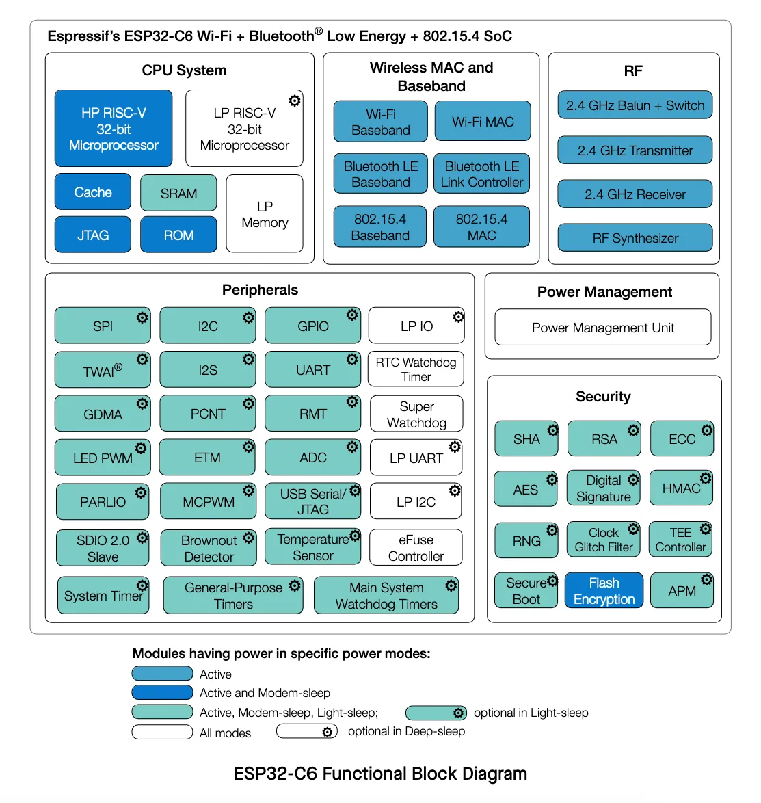
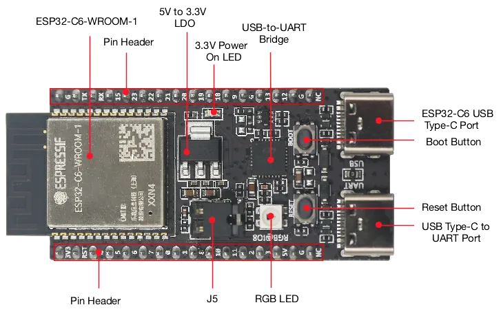
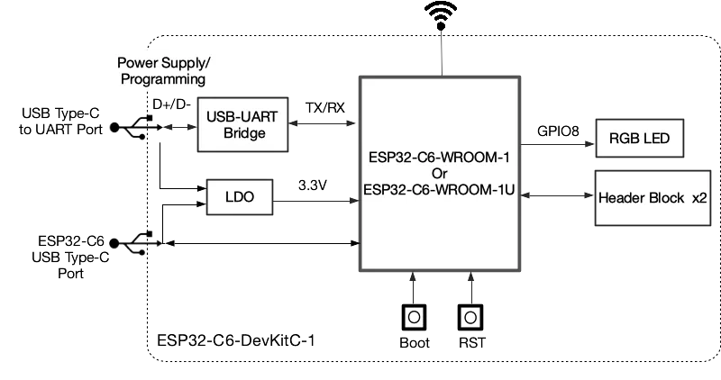
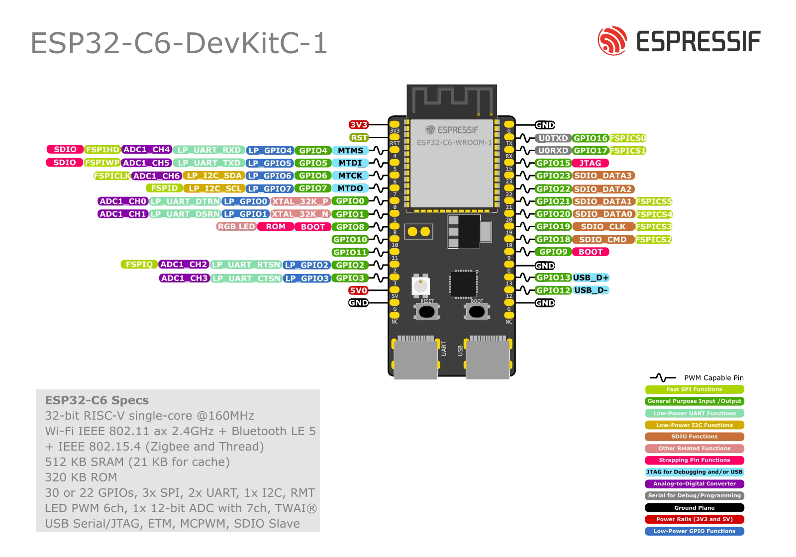

## ESP-IDF Presentation

**ESP-IDF** (Espressif IoT Development Framework) is the official development framework for all ESP32 family chips from Espressif Systems. The framework provides a complete environment for developing, flashing and monitoring IoT applications that can cover everything from networks through security to highly reliable applications. The ESP32 chips themselves are popular across industries, from home hobbyists and makers to professional and industrial deployment.

ESP-IDF also includes FreeRTOS, which allows developers to create *real-time* applications with multitasking support. Thanks to a wide palette of libraries, components, supported protocols (Wi-Fi, Bluetooth, Thread, ZigBee, MQTT and many more), tools and detailed documentation, ESP-IDF facilitates IoT application development and enables easy use of a large spectrum of hardware and peripherals.

At the same time, ESP-IDF contains approximately 400 example projects covering basic use cases, which allows developers to further accelerate the initial development phase and thus they can start working on their projects faster.

### Architecture

The ESP-IDF framework architecture is divided into 3 layers:

- **ESP-IDF platform**
  - Contains the ESP-IDF core itself: FreeRTOS, drivers, protocols, build system...
- **Middleware**
  - Adds additional functionality to ESP-IDF, for example ESP-ADF audio framework
- **AIoT applications**
  - Your project


  


### Frameworks

Several other frameworks are also based on ESP-IDF:

- **Arduino for ESP32**
- **ESP-ADF** (Audio Development Framework): Ready for audio applications
- **ESP-WHO** (AI Development Framework): Focused on face recognition and detection
- **ESP-RainMaker**: Thanks to cloud services, it simplifies connecting and controlling ESP32 devices
- **ESP-Matter SDK**: Official development framework for Matter on ESP32 family chips

If you want to look at all derived frameworks, visit our [GitHub](https://github.com/espressif).

### Support for different ESP-IDF versions

ESP-IDF is still evolving. For current information about supported versions, visit our Github.



## ESP32-C6 Presentation

ESP32-C6 is an *ultra-low-power* chip with RISC-V architecture. It contains one "full-featured" and one ULP (*ultra-low-power*) core and supports all common wireless technologies: 2.4 GHz Wi-Fi 6 (802.11ax), Bluetooth® 5 (LE), Zigbee and Thread (802.15.4). Optional 4MB flash memory is available directly in the chip package, 22 or 30 GPIO pins and a rich selection of peripherals:


  


- 30 (QFN40) or 22 (QFN32) pins
- 5 strapping pins
- 6 GPIO pins are needed for in-package flash
- **Analog interfaces:**
  - 12-bit SAR ADC, up to 7 channels
  - Temperature sensor
- **Digital interfaces:**
  - 2x UARTs
  - Low-power (LP) UART
  - 2x SPI for flash memory communication
  - General purpose SPI
  - I2C
  - Low-power (LP) I2C
  - I2S
  - Pulse count controller
  - USB Serial/JTAG controller
  - 2x TWAI® controllers, compatible with ISO 11898-1 (CAN Specification 2.0)
  - SDIO 2.0 slave controller
  - LED PWM controller, up to 6 channels
  - Motor Control PWM (MCPWM)
  - Remote control peripherals (TX/RX)
  - Parallel IO interface (PARLIO)
  - General DMA controller with 3 transmit 3 receive channels
  - Event task matrix (ETM)
- **Timers:**
  - 52-bit system timer
  - 2x 54-bit general purpose timers
  - 3x digital watchdog
  - Analog watchdog

For more details, see the [ESP32-C6 datasheet](https://www.espressif.com/sites/default/files/documentation/esp32-c6_datasheet_en.pdf).

## ESP32-C6-DevKit-C Kit Presentation

ESP32-C6-DevKitC-1 is a development board designed for (not only) beginners, at the heart of which is the ESP32-C6-WROOM-1(U) module along with 8 MB SPI flash memory. Like the ESP32-C6 chip itself, the board supports many protocols, from Wi-Fi, through Bluetooth LE, to Zigbee and Thread.

Most GPIO pins are accessible from pins on the sides of the board with standard 2.54 mm pitch. Peripherals can be connected to them using classic wires, or the board can be snapped into a breadboard.

### Features

Below are the basic features of the development kit:

- ESP32-C6-WROOM-1 module
- Pin headers on the sides
- 5 V to 3.3 V low-dropout regulator
- 3.3 V Power On LED
- USB-to-UART Bridge
- ESP32-C6 USB Type-C Port for flashing and debug
- Boot Button
- Reset Button
- USB Type-C to UART Port
- RGB LED on GPIO8 pin
- J5 jumper for current measurement

#### Board Description


  
  


#### Board Layout


  


#### J1 Pin Header

| No. | Name | Type | Function |
|---|---|---|---|
| 1 | 3V3 | P | 3.3 V power supply |
| 2 | RST | I | High: enables the chip; Low: disables the chip. |
| 3 | 4 | I/O/T | MTMS, GPIO4, **LP_GPIO4**, **LP_UART_RXD**, ADC1_CH4, FSPIHD |
| 4 | 5 | I/O/T | MTDI, GPIO5, **LP_GPIO5**, **LP_UART_TXD**, ADC1_CH5, FSPIWP |
| 5 | 6 | I/O/T | MTCK, GPIO6, **LP_GPIO6**, **LP_I2C_SDA**, ADC1_CH6, FSPICLK |
| 6 | 7 | I/O/T | MTDO, GPIO7, **LP_GPIO7**, **LP_I2C_SCL**, FSPID |
| 7 | 0 | I/O/T | GPIO0, XTAL_32K_P, **LP_GPIO0**, **LP_UART_DTRN**, ADC1_CH0 |
| 8 | 1 | I/O/T | GPIO1, XTAL_32K_N, **LP_GPIO1**, **LP_UART_DSRN**, ADC1_CH1 |
| 9 | 8 | I/O/T | GPIO8 |
| 10 | 10 | I/O/T | GPIO10 |
| 11 | 11 | I/O/T | GPIO11 |
| 12 | 2 | I/O/T | GPIO2, **LP_GPIO2**, **LP_UART_RTSN**, ADC1_CH2, FSPIQ |
| 13 | 3 | I/O/T | GPIO3, **LP_GPIO3**, **LP_UART_CTSN**, ADC1_CH3 |
| 14 | 5V | P | 5 V power supply |
| 15 | G | G | Ground |
| 16 | NC | – | No connection |

#### J3 Pin Header

| No. | Name | Type | Function |
|---|---|---|---|
| 1 | G | G | Ground |
| 2 | TX | I/O/T | U0TXD, GPIO16, FSPICS0 |
| 3 | RX | I/O/T | U0RXD, GPIO17, FSPICS1 |
| 4 | 15 | I/O/T | GPIO15 |
| 5 | 23 | I/O/T | GPIO23, SDIO_DATA3 |
| 6 | 22 | I/O/T | GPIO22, SDIO_DATA2 |
| 7 | 21 | I/O/T | GPIO21, SDIO_DATA1, FSPICS5 |
| 8 | 20 | I/O/T | GPIO20, SDIO_DATA0, FSPICS4 |
| 9 | 19 | I/O/T | GPIO19, SDIO_CLK, FSPICS3 |
| 10 | 18 | I/O/T | GPIO18, SDIO_CMD, FSPICS2 |
| 11 | 9 | I/O/T | GPIO9 |
| 12 | G | G | Ground |
| 13 | 13 | I/O/T | GPIO13, USB_D+ |
| 14 | 12 | I/O/T | GPIO12, USB_D- |
| 15 | G | G | Ground |
| 16 | NC | – | No connection |

### Resources

- [ESP32-C6 Datasheet](https://www.espressif.com/sites/default/files/documentation/esp32-c6_datasheet_en.pdf)
- [ESP32-C6 Documentation](https://docs.espressif.com/projects/esp-idf/en/release-v5.5/esp32c6/index.html)
- [ESP32-C6-DevKit-C Documentation](https://docs.espressif.com/projects/espressif-esp-dev-kits/en/latest/esp32c6/esp32-c6-devkitc-1/user_guide.html)

## Next Step

After the theoretical introduction, it's time to start programming. But first we need to install the necessary tools.

[Assignment 1: ESP-IDF Installation](../assignment-1)