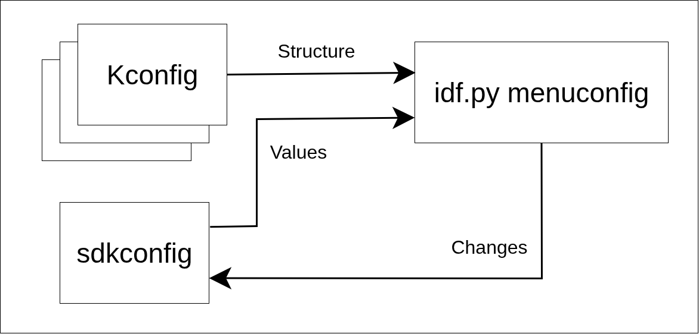

# esp-idf-kconfig v3: default values

Lately, we released new ESP-IDF configuration system (esp-idf-kconfig v3), which is coming with many exciting features. Today, we are going to have a look at default values.

First, lets briefly explain how configuration has worked in ESP-IDF so far. There are two important files: **Kconfig** and **sdkconfig**. 

**Kconfig** contains the definition of config options: their name, prompt, type, help text and, which we will be especially interested in, may also contain default values for our config options:

```
config OTHER_CONFIG_OPTION
    bool "Prompt for other config option"
    default y

config CONFIG_OPTION
    int "Prompt for config option"
    help
        This config option will help us understand default values in ESP-IDF configuration.
    default 1 if OTHER_CONFIG_OPTION
    default 0    
```

You see, our `CONFIG_OPTION` has two default values, one having a condition, one does not. How do we (or more precisely, the configuration system) decide which default value to use? 

Easily. We will go from top to bottom and check whether the condition for given default value is true (if there is no condition, we suppose we can use that default value once we reach its row): 

First default value is 1 if OTHER_CONFIG_OPTION is true. The default value of `OTHER_CONFIG_OPTION` is y (which, in configuration system context equals to "true") -> condition is met and the default value for our `CONFIG_OPTION` should be 1.

Will the configuration system agree? 

While we firstly build the project, configuration system collects all the Kconfig files relevant for our project and assigns default value to every config option in the same way we did above.

Because this process is resource-heavy, we want to store this information somewhere, so we do not need to re-evaluate all the config options every time we need to lookup for a value of some config option.

For that reason, we save which config option has which value. The name of the file we save this information to is **sdkconfig**:

```
(...)
CONFIG_OTHER_CONFIG_OPTION=y # OTHER_CONFIG_OPTION is evaluated as truly, so our CONFIG_OPTION will have default value equal to 1
CONFIG_CONFIG_OPTION=1
(...)
```

> **_NOTE:_** you see our `CONFIG_OPTION` got a `CONFIG_` prefix. This helps to distinguish between config option and other type of variable when using there information e.g. in your C code. 


<div align="center">

  *Figure 1: Default values during the first run*

</div>


Nice! The configuration system did what we supposed it will do. 

However, we are often not happy with the default values and want to change them manually through e.g. menuconfig.
When we run `idf.py menuconfig`, configuration system once again loads Kconfig files, but this time, it also loads the sdkconfig file and sets all the config options to the values set in there.
Now, let's disable `OTHER_CONFIG_OPTION` in menuconfig and save the configuration.

Let's check the sdkconfig:

```
(...)
# CONFIG_OTHER_CONFIG_OPTION is not set # this is the same as CONFIG_OTHER_CONFIG_OPTION=n
CONFIG_CONFIG_OPTION=1
(...)
```


<div align="center">   
  *Figure 2: How menuconfig loads and saves values*
</div>


**Wait!** Why `CONFIG_OPTION` is still 1?

Great question. 

As we said before, configuration system saves the values for all config options in sdkconfig file.
However, when it loads those values back, it "locks" config options on those values -- meaning their default values (as we saw them in Kconfig file) will no longer be in use. This can lead to confusing situations like we just witnessed. 

## Solution? New configuration system!

So, how does the new configuration system do the things differently? Let's go through the process again.

When we firstly build the project, configuration system loads the relevant Kconfig files and saves default values to sdkconfig file like before. Let's see the sdkconfig file again:

```
(...)
# default:
CONFIG_OTHER_CONFIG_OPTION=y
# default:
CONFIG_CONFIG_OPTION=1
(...)
```

See the difference? 

All config options with default values are now marked with `# default:` mark right above them. Configuration system now knows which config options should be re-evaluated during the menuconfig session, because their default values may change. 


<div align="center">

  *Figure 3: New first run*

</div>

Let's run menuconfig once again, disable `OTHER_CONFIG_OPTION` and save it:

```
(...)
# CONFIG_OTHER_CONFIG_OPTION is not set
# default:
CONFIG_CONFIG_OPTION=0
(...)
```

That's different!

You see, `OTHER_CONFIG_OPTION` now lost its `# default:` mark - that's correct, we manually set it to other than default value.
What is interesting that `CONFIG_OPTION` **registered this change**. Now, the condition for the first default value is not valid, so we need to use the second one. 


<div align="center">

  *Figure 4: How new menuconfig works*

</div>

Great! Now, default values work as expected. 

## New problems arise

Now, let's suppose `CONFIG_OPTION` was a part of a component. In the new version of the component, its definition (especially the default value) has changed:

```
config CONFIG_OPTION
    int "Prompt for config option"
    help
        New version of CONFIG_OPTION.
    default 99 # different from the previous version!
```

What does it mean for us? Configuration tool now has two contradicting pieces of information: 

* Kconfig file says that the default value for `CONFIG_OPTION` is 99
* sdkconfig says that it is 0.

How will the configuraiton system solve this? 

First of all, it notifies the user: 

```
info: Default value for CONFIG_OPTION in sdkconfig is 0 but it is 99 according to Kconfig.
```

Then, configuration system must decide which source to trust more. 

By default, **sdkconfig has a precedence**. It ensures the same values will be passed to build system even after e.g. component update. 

But we may want to use default value from Kconfig (new component version relies on that value or it is just favorable for us).
Or, if there is not only one config option changed, but several, we want to choose which default value to use separately for each config option. 

No worries, we can do exactly that. ESP-IDF introduced new command: `idf.py reload-default-values`. It takes one parameter: `--defaults-policy`, which can have following values: 

* `sdkconfig`: default values from sdkconfig will be used. In our case, our `CONFIG_OPTION` would have default value 0.
* `kconfig`: default values from Kconfig file will be used. That means our `CONFIG_OPTIN` would have the value 99.
* `interactive`: this option allows you to choose the source of default value for each affected config option manually. 


<div align="center">

  *Figure 5: How idf.py reload-default-values works based on defaults policy chosen*

</div>

Running this command will eliminate any discrepancies which may arise when Kconfig definition of config option will change and will no longer be the same as stored in sdkconfig.  

With all that being said, you know how default values work in new ESP-IDF configuration system!

Otázky pro vážené čtenářstvo: 

* Očekáváte, že po `idf.py reload-default-values --defaults-policy sdkconfig` budete dostávat warning tom, že se default values liší mezi sdkconfigem a kconfigem?
* Co říkáte na název `idf.py reload-default-values`? Jsou tu lidé, kteří by raději viděli jméno `idf.py load-defconfig` jako opačnou operaci k `idf.py save-defconfig`. 


